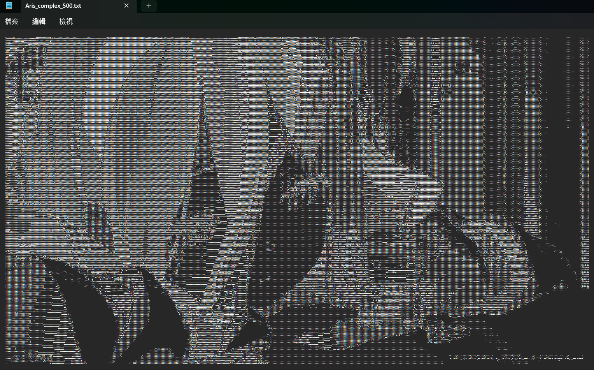
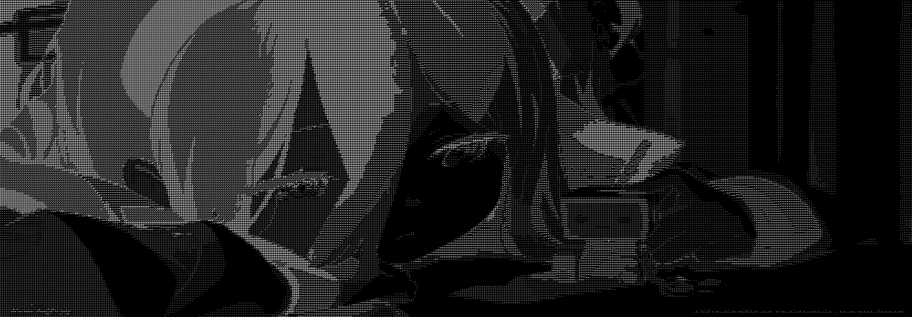
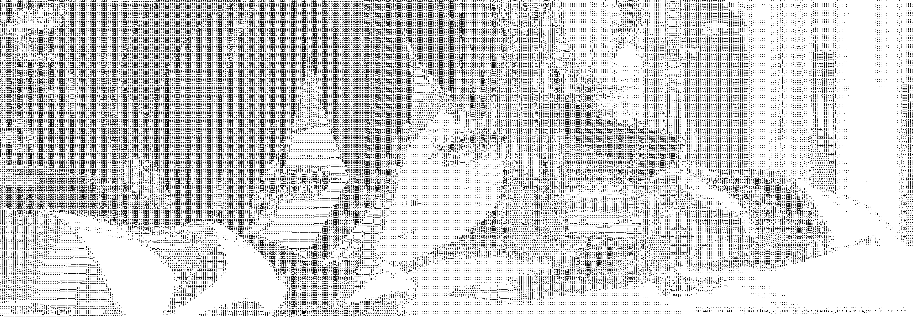

## Image ASCII Art

<a href="./README.md">English</a> | <a href="./README.zh-TW.md">繁體中文</a>

The project is a **simplified C language version** of [ASCII-generator](https://github.com/vietnh1009/ASCII-generator?tab=readme-ov-file).  
It aims to reimplement part of its core functionalities in C, providing a simple tool for converting images into ASCII art.

## Project Scope
- Focuses on converting images to ASCII art. Convertion for videos is not included at this stage.
- Simplifies the multilingual character sets from `ASCII-generator`, providing only general-purpose character sets (simple and complex).

## Function Modules

| File Name           | Description                  | Status    |
|---------------------|------------------------------|-----------|
| `img2txt.py`        | Image → Text                 | ✓         |
| `img2img.py`        | Image → Grayscale ASCII Art  | ✓         |
| `img2img_color.py`  | Image → Color ASCII Art      |           |

## How to Use

1. **Build Executable**  
    You can use either the `Makefile` or `script/build.ps1` to compile the source code.  
    The build process will generate `main` (Unix/Linux) or `main.exe` (Windows).
2. **Run `main`** 
    ```plaintext
    Parameters
        --type          Required. Function type.
        --input         Required. Path to the input image.
        --output        Required. Path to the output file.
        --num_cols      Optional. Number of output columns.
        --mode          Optional. Character set.
        --background    Optional. Background color.

    Accepted values and defaults
        --type          ["text", "image"]
        --input         Path string
        --output        Path string
        --num_cols      Integer                Default: 300
        --mode          ["simple", "complex"]  Default: complex
        --background    ["white", "black"]     Default: black
    ```

    #### Example Commands

    ##### Text Output
    ```bash
    ./main --type text --input ./input.png --output ./output.txt
    ```
    ##### Grayscale ASCII Image Output (Black Background)
    ```bash
    ./main --type image --input ./input.png --output ./output.png --mode complex --background black
    ```

    ##### Grayscale ASCII Image Output (White Background)
    ```bash
    ./main --type image --input ./input.png --output ./output.png --num_cols 200 --mode simple --background white
    ```

## Demo

<p align="center">
  <i>Raw Image</i><br/>
  
</p>

<p align="center">
  <i>Image to Text</i><br/>
  
</p>

<p align="center">
  <i>Image to Grayscale ASCII Image</i><br/>
  <br/>
  
</p>

## References & Tools
- [vietnh1009/ASCII-generator](https://github.com/vietnh1009/ASCII-generator)：Original logic for image-to-ASCII conversion.
- [nothings/stb](https://github.com/nothings/stb)：Lightweight C image processing tool.

## Additional Notes
> Although the project attempts to reproduce the effects of ASCII-generator, the differences in the programming language and image processing tool may result in slight variations in the output.