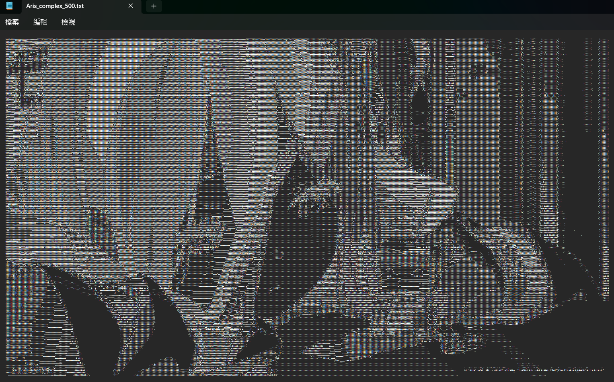
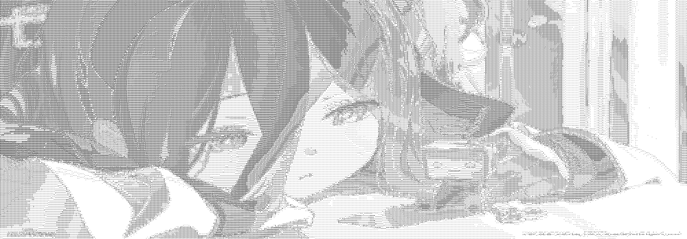

# 圖片 ASCII 藝術 

<a href="./README.md">English</a> | <a href="./README.zh-TW.md">繁體中文</a>

本專案為 [ASCII-generator](https://github.com/vietnh1009/ASCII-generator?tab=readme-ov-file) 的 **C 語言簡化版本**  
旨在以 C 語言實作其部分核心功能，提供簡單的圖片 ASCII 藝術生成工具。

## 專案定位

- 以圖片轉換為 ASCII 藝術為主要功能，故暫不涵蓋影像 ASCII 轉換。
- 簡化 `ASCII-generator` 中多語系字符表，僅提供通用字符集（簡易版與複雜版）。


## 功能模組

| 對應檔案名稱        | 說明                     | 狀態       |
|--------------------|-------------------------|------------|
| `img2txt.py`       | 圖片 → 文字              | ✓         |
| `img2img.py`       | 圖片 → 黑白 ASCII 圖片   | ✓         |
| `img2img_color.py` | 圖片 → 彩色 ASCII 圖片   | ✓         |

## 如何使用

1. **產生可執行檔**  
    可使用 `Makefile` 或 `script/build.ps1` 進行編譯，編譯後會產生 `main` 或 `main.exe` 可執行檔案。

2. **執行 `main`** 
    ```
    參數介紹 
        --type          必要，功能選擇
        --input         必要，輸入圖檔路徑
        --output        必要，輸出檔案路徑
        --num_cols      可選，輸出字符行數
        --mode          可選，字符集選擇
        --background    可選，背景顏色

    參數數值範圍與預設值
        --type          ["text", "image", "image_color"]
        --input         路徑字串  
        --output        路徑字串
        --num_cols      整數                    預設為 300
        --mode          ["simple", "complex"]   預設為 complex
        --background    ["white", "black"]      預設為 black
    ```
    #### 執行範例

    ##### 文字輸出
    ```bash
    ./main --type text --input ./input.png --output ./output.txt
    ```
    ##### 以黑白圖片輸出（黑底）
    ```bash
    ./main --type image --input ./input.png --output ./output.png --mode complex --background black
    ```

    ##### 以色彩圖片輸出（白底）
    ```bash
    ./main --type image_color --input ./input.png --output ./output.png --num_cols 200 --mode simple --background white
    ```


## 畫面參考

<p align="center">
  <i>原始圖片</i><br/>
  
</p>

<p align="center">
  <i>圖片轉文字</i><br/>
  
</p>

<p align="center">
  <i>圖片轉黑白 ASCII 圖片</i><br/>
  <br/>
  
</p>

<p align="center">
  <i>圖片轉彩色 ASCII 圖片</i><br/>
  
  <br/>
</p>

## 參考資料與使用工具
- [vietnh1009/ASCII-generator](https://github.com/vietnh1009/ASCII-generator)：圖片轉 ASCII 的主要邏輯來源
- [nothings/stb](https://github.com/nothings/stb)：C 語言圖片處理工具

## 其他說明
> 盡量有嘗試複刻 ASCII-generator 的效果，但由於圖片處理工具的差異，故生成結果會略有不同。